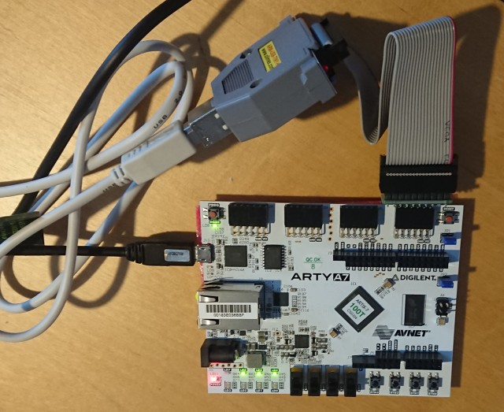

# Risc-V experiments on Arty A7



## links

### Tools

- [chisel bootcamp](https://riscv.org/wp-content/uploads/2015/01/riscv-chisel-tutorial-bootcamp-jan2015.pdf)
- [chisel homepage](https://www.chisel-lang.org/)

### Arty A7 Tutorials

- [DigiKey](https://www.digikey.com/eewiki/display/LOGIC/Digilent+Arty+A7+with+Xilinx+Artix-7+Implementing+SiFive+FE310+RISC-V)
- [Digilent](https://reference.digilentinc.com/reference/programmable-logic/arty-a7/arty_a7_100_risc_v/start)
- [SiFive](https://static.dev.sifive.com/SiFive-E310-arty-gettingstarted-v1.0.6.pdf)

## Hints

### identify USB devices

get mapping information via

```bash
$ ls -l /dev/serial/by-id
total 0
lrwxrwxrwx 1 root root 13 Feb 13 20:17 usb-15ba_Olimex_OpenOCD_JTAG_ARM-USB-TINY-H_OL9533D9-if01-port0 -> ../../ttyUSB2
lrwxrwxrwx 1 root root 13 Feb 13 20:17 usb-Digilent_Digilent_USB_Device_210319AFEE0C-if01-port0 -> ../../ttyUSB1
```

## Level 0 - FPGA test

To check basic function of the Toolset and the FPGA board ..

.. build the Xilinx docker image

```bash
$ cd docker/xilinx
$ <download Vivado webpack installer>
$ ./Xilinx_Unified_2020.2_1118_1232_Lin64.bin -- --batch AuthTokenGen
$ cp ~/.Xilinx/wi_authentication_key .
$ ./build.sh
```

.. start an interactive docker session and build the `vivado_getting_started` project in Vivado

```bash
$ docker/xilinx/run.sh
$ vivado
```

## Level 1 - run "Hello World" on synthesized E310 core

### prepare tools

build the docker image with the SiFive toolchain

```bash
$ cd docker/risc-v
$ ./build.sh
```

### build verilog and synthesize design

If using the Arty A7 100 Board set the board type accordingly
```diff
diff --git a/Makefile.e300artydevkit b/Makefile.e300artydevkit
index 110c08a..3476a60 100644
--- a/Makefile.e300artydevkit
+++ b/Makefile.e300artydevkit
@@ -6,7 +6,7 @@ MODEL := E300ArtyDevKitFPGAChip
 PROJECT := sifive.freedom.everywhere.e300artydevkit
 export CONFIG_PROJECT := sifive.freedom.everywhere.e300artydevkit
 export CONFIG := E300ArtyDevKitConfig
-export BOARD := arty
+export BOARD := arty_a7_100
 export BOOTROM_DIR := $(base_dir)/bootrom/xip
 
 rocketchip_dir := $(base_dir)/rocket-chip
```

Run the risc-v docker image and build the verilog sources from the chisel sources:

```bash
$ docker/risc-v/run.sh
$ . clean.sh
$ cd sifive-freedom
$ make -f Makefile.e300artydevkit verilog
```

The verilog should be in `builds/e300artydevkit/sifive.freedom.everywhere.e300artydevkit.E300ArtyDevKitConfig.v`

Synthesize the verilog for the FPGA (still in the risc-v docker)

```bash
$ make -f Makefile.e300artydevkit mcs
```

after which the output is in `builds/e300artydevkit/obj`.

### Program the FPGA:

1. Open Vivado, go to "Flow -> Open Hardware Manager"
1. "Open Target -> Auto connect"
1. select device xc7a100t_0, right click "Add Configuration Memory Device" and select alias s25fl127s-spi-x1_x2_x4
1. select OK when asked if you want to program the configuration and select the .mcs from the obj directory
1. when programming the FPGA was successful, press the "PROG" button on the FPGA board

### build the Hello World

1. connect the Olimex to JD of the FPGA board
1. change to the `freedom-e-sdk` directory
1. `make BSP=metal PROGRAM=hello TARGET=freedom-e310-arty clean`
1. `make BSP=metal PROGRAM=hello TARGET=freedom-e310-arty software`
1. `make BSP=metal PROGRAM=hello TARGET=freedom-e310-arty upload`
1. `tio /dev/ttyUSB0 -b 57600` should show "Hello World!" now